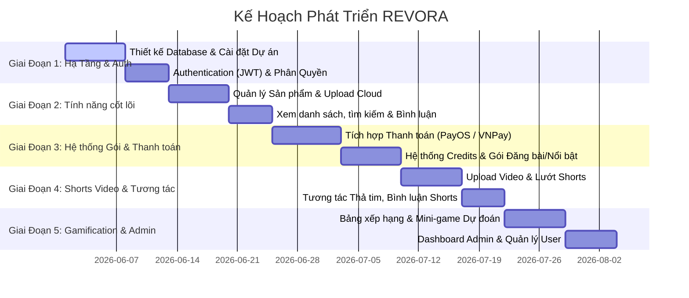

# KẾ HOẠCH PHÁT TRIỂN DỰ ÁN REVORA - SÀN THƯƠNG MẠI ĐIỆN TỬ C2C

Dự án **REVORA** là nền tảng thương mại điện tử C2C (Consumer-to-Consumer) cho phép người dùng tự do trao đổi, mua bán đồ cũ hoặc sản phẩm cá nhân. Hệ thống được phát triển với mô hình phân quyền rõ ràng, hệ thống gói dịch vụ đăng tin/nổi bật nhằm tối ưu hóa doanh thu, đi kèm các tính năng tương tác mạng xã hội hiện đại (Short Video, Bảng xếp hạng, Game dự đoán).

---

## 1. Công Nghệ Sử Dụng (Technology Stack)

*   **Frontend**: React (SPA), sử dụng Axios hoặc React Query để tương tác API, TailwindCSS / CSS Vanilla cho phần giao diện mượt mà và tối ưu responsive.
*   **Backend**: ASP.NET Core Web API (.NET 8/9).
*   **Database**: SQL Server, quản lý thông qua Entity Framework Core (Code First).
*   **Cloud Storage**: Lưu trữ hình ảnh và video shorts trên dịch vụ Cloud (khuyên dùng **Cloudinary** vì hỗ trợ CDN tốt cho cả hình ảnh và tối ưu video stream, hoặc **AWS S3** / **Azure Blob Storage**).
*   **Cổng thanh toán**: Tích hợp **PayOS** và **VNPay** để thực hiện mua các gói đăng bài/nổi bật.

---

## 2. Phân Quyền & Các Tính Năng Chi Tiết (Role & Feature Specification)

Hệ thống bao gồm 2 Role chính được định nghĩa trong [RoleType.cs](file:///d:/Documments/EXE%20code/REVORA_BE/REVORA_BE/Enums/RoleType.cs):

### A. Role: Admin (Quản trị viên)
1.  **Dashboard Tổng quan & Doanh thu**:
    *   Thống kê số lượng người dùng mới đăng ký, số tin đăng đang hoạt động, số video shorts được tạo.
    *   Biểu đồ doanh thu từ việc bán các gói dịch vụ theo ngày, tuần, tháng, năm.
    *   Thống kê tỷ lệ chuyển đổi và các gói phổ biến nhất.
2.  **Quản lý Gói dịch vụ (Credits & Packages)**:
    *   Cấu hình thông tin các gói mua bằng tiền mặt (Paid Credit Packages) thông qua [PaidCreditPackage.cs](file:///d:/Documments/EXE%20code/REVORA_BE/REVORA_BE/Models/PaidCreditPackage.cs).
    *   Cấu hình các gói tặng/thưởng miễn phí (Free Credit Packages) qua [FreeCreditPackage.cs](file:///d:/Documments/EXE%20code/REVORA_BE/REVORA_BE/Models/FreeCreditPackage.cs).
    *   **Phân loại gói dịch vụ**:
        *   **Gói đăng bài (Posting Package)**: Dùng để trừ lượt khi đăng bán sản phẩm thông thường.
        *   **Gói nổi bật (Highlight Package)**: Cho phép đưa sản phẩm lên trang nổi bật, hiển thị banner quảng cáo và đăng video short đính kèm.
        *   **Thời hạn**: Mỗi loại gói chia thành 3 kỳ hạn: **1 ngày**, **7 ngày**, **30 ngày** (Được lưu qua thuộc tính `DurationDays` trong database).
3.  **Quản lý người dùng (User Management)**:
    *   Xem danh sách người dùng toàn hệ thống.
    *   Xem lịch sử giao dịch mua gói dịch vụ chi tiết của từng User thông qua bảng [Order.cs](file:///d:/Documments/EXE%20code/REVORA_BE/REVORA_BE/Models/Order.cs).
    *   Kích hoạt (Active) hoặc khóa tài khoản (Inactive) của người dùng thông qua thuộc tính `IsActive` của [User.cs](file:///d:/Documments/EXE%20code/REVORA_BE/REVORA_BE/Models/User.cs).

### B. Role: User (Người dùng - vừa mua vừa bán)
1.  **Tính năng cho Người Mua (Buyer)**:
    *   Xem danh sách sản phẩm theo danh mục, tìm kiếm và lọc sản phẩm (giá, độ mới [ProductCondition.cs](file:///d:/Documments/EXE%20code/REVORA_BE/REVORA_BE/Enums/ProductCondition.cs), khu vực).
    *   Xem chi tiết sản phẩm, bình luận hỏi đáp ([ProductComment.cs](file:///d:/Documments/EXE%20code/REVORA_BE/REVORA_BE/Models/ProductComment.cs)).
    *   Thêm sản phẩm vào danh sách yêu thích ([Wishlist.cs](file:///d:/Documments/EXE%20code/REVORA_BE/REVORA_BE/Models/Wishlist.cs)).
    *   **Liên hệ người bán**: Nút "Liên hệ người bán" chuyển hướng trực tiếp đến khung chat Zalo của người bán bằng cách nhúng số điện thoại: `https://zalo.me/<Phone>`.
2.  **Tính năng cho Người Bán (Seller)**:
    *   **Mua gói**: Chọn mua gói đăng bài hoặc nổi bật thông qua cổng thanh toán PayOS/VNPay. Hệ thống ghi nhận số dư lượt dùng dưới dạng Credit Batch ([UserCreditBatch.cs](file:///d:/Documments/EXE%20code/REVORA_BE/REVORA_BE/Models/UserCreditBatch.cs)) có hạn dùng cụ thể.
    *   **Đăng bán sản phẩm**:
        *   Khi đăng tin thường: Hệ thống kiểm tra và trừ 1 lượt đăng bài còn hạn.
        *   Khi sử dụng gói nổi bật: Cho phép sản phẩm lên mục tiêu điểm, đẩy banner lên trang chủ (`BannerUrl` trong [Product.cs](file:///d:/Documments/EXE%20code/REVORA_BE/REVORA_BE/Models/Product.cs)) và tạo video ngắn quảng bá đính kèm link sản phẩm ([Short.cs](file:///d:/Documments/EXE%20code/REVORA_BE/REVORA_BE/Models/Short.cs)).
3.  **Mạng xã hội & Shorts Video**:
    *   Trải nghiệm lướt video ngắn (TikTok-style) giới thiệu sản phẩm. Người dùng có thể thả tim ([ShortLike.cs](file:///d:/Documments/EXE%20code/REVORA_BE/REVORA_BE/Models/ShortLike.cs)) và bình luận ([ShortComment.cs](file:///d:/Documments/EXE%20code/REVORA_BE/REVORA_BE/Models/ShortComment.cs)).
    *   Từ video ngắn có thể click trực tiếp để chuyển hướng đến trang thông tin sản phẩm liên kết ([ProductId] trong [Short.cs](file:///d:/Documments/EXE%20code/REVORA_BE/REVORA_BE/Models/Short.cs)).
4.  **Bảng xếp hạng & Game dự đoán (Gamification)**:
    *   **Bảng xếp hạng**: Tôn vinh các người bán chạy nhất hoặc uy tín nhất, hiển thị huy hiệu danh hiệu ([Badge.cs](file:///d:/Documments/EXE%20code/REVORA_BE/REVORA_BE/Models/Badge.cs)).
    *   **Dự đoán bảng xếp hạng bán chạy**: Người dùng tham gia mini-game dự đoán Top 1, Top 2, Top 3 người bán chạy nhất của tuần/tháng.
    *   **Phần thưởng**: Người dự đoán chính xác sẽ nhận được phần thưởng tự động từ hệ thống là các gói đăng bài hoặc gói nổi bật miễn phí (thông qua [FreeCreditPackage.cs](file:///d:/Documments/EXE%20code/REVORA_BE/REVORA_BE/Models/FreeCreditPackage.cs)).

---

## 3. Kiến Trúc Dữ Liệu Hiện Tại (Current Database Schema)

Cơ sở dữ liệu của REVORA được ánh xạ trong [AppDbContext.cs](file:///d:/Documments/EXE%20code/REVORA_BE/REVORA_BE/Models/AppDbContext.cs) gồm các nhóm bảng chính:

1.  **Nhóm Người Dùng & Phân Quyền**:
    *   [User.cs](file:///d:/Documments/EXE%20code/REVORA_BE/REVORA_BE/Models/User.cs): Thông tin tài khoản, avatar, trạng thái hoạt động, số điện thoại Zalo.
    *   [Role.cs](file:///d:/Documments/EXE%20code/REVORA_BE/REVORA_BE/Models/Role.cs) & [RoleType.cs](file:///d:/Documments/EXE%20code/REVORA_BE/REVORA_BE/Enums/RoleType.cs): Quản lý quyền hạn (Admin, User).
    *   [UserFollow.cs](file:///d:/Documments/EXE%20code/REVORA_BE/REVORA_BE/Models/UserFollow.cs): Quan hệ theo dõi giữa các người dùng.
    *   [Badge.cs](file:///d:/Documments/EXE%20code/REVORA_BE/REVORA_BE/Models/Badge.cs) & [UserBadge.cs](file:///d:/Documments/EXE%20code/REVORA_BE/REVORA_BE/Models/UserBadge.cs): Hệ thống huy hiệu/danh hiệu cho người dùng.
2.  **Nhóm Sản Phẩm & Mạng Xã Hội**:
    *   [Product.cs](file:///d:/Documments/EXE%20code/REVORA_BE/REVORA_BE/Models/Product.cs): Thông tin chi tiết sản phẩm, trạng thái nổi bật (`IsUsedBanner`, `BannerUrl`, `BannerExpiredAt`, `IsUsedShort`).
    *   [ProductImage.cs](file:///d:/Documments/EXE%20code/REVORA_BE/REVORA_BE/Models/ProductImage.cs): Hình ảnh chi tiết sản phẩm (Lưu URL Cloud).
    *   [Category.cs](file:///d:/Documments/EXE%20code/REVORA_BE/REVORA_BE/Models/Category.cs): Danh mục phân loại sản phẩm.
    *   [Wishlist.cs](file:///d:/Documments/EXE%20code/REVORA_BE/REVORA_BE/Models/Wishlist.cs): Sản phẩm yêu thích của người dùng.
    *   [ProductComment.cs](file:///d:/Documments/EXE%20code/REVORA_BE/REVORA_BE/Models/ProductComment.cs) & [ProductCommentLike.cs](file:///d:/Documments/EXE%20code/REVORA_BE/REVORA_BE/Models/ProductCommentLike.cs): Bình luận và lượt thích bình luận sản phẩm.
3.  **Nhóm Video Ngắn (Shorts)**:
    *   [Short.cs](file:///d:/Documments/EXE%20code/REVORA_BE/REVORA_BE/Models/Short.cs): Video ngắn đính kèm sản phẩm (`VideoUrl` trỏ đến Cloud).
    *   [ShortLike.cs](file:///d:/Documments/EXE%20code/REVORA_BE/REVORA_BE/Models/ShortLike.cs) & [ShortComment.cs](file:///d:/Documments/EXE%20code/REVORA_BE/REVORA_BE/Models/ShortComment.cs): Tương tác cho video ngắn.
4.  **Nhóm Gói Dịch Vụ & Đơn Hàng**:
    *   [CreditType.cs](file:///d:/Documments/EXE%20code/REVORA_BE/REVORA_BE/Models/CreditType.cs): Loại tín dụng (Đăng bài bình thường hoặc Nổi bật).
    *   [PaidCreditPackage.cs](file:///d:/Documments/EXE%20code/REVORA_BE/REVORA_BE/Models/PaidCreditPackage.cs): Các gói trả phí admin cấu hình (1 ngày, 7 ngày, 30 ngày).
    *   [FreeCreditPackage.cs](file:///d:/Documments/EXE%20code/REVORA_BE/REVORA_BE/Models/FreeCreditPackage.cs): Các gói miễn phí dùng làm phần thưởng dự đoán.
    *   [UserCreditBatch.cs](file:///d:/Documments/EXE%20code/REVORA_BE/REVORA_BE/Models/UserCreditBatch.cs): Số dư lượt đăng/lượt nổi bật của User kèm ngày hết hạn (`ExpiresAt`).
    *   [Order.cs](file:///d:/Documments/EXE%20code/REVORA_BE/REVORA_BE/Models/Order.cs): Lịch sử giao dịch mua gói dịch vụ thanh toán qua PayOS/VNPay.

---

## 4. Kế Hoạch Triển Khai Chi Tiết (Implementation Plan Roadmap)

Kế hoạch phát triển dự án được chia làm 5 giai đoạn:



### Giai đoạn 1: Hạ tầng backend, Frontend Setup & Đăng nhập (Mục tiêu: 12 ngày)
*   **Backend (ASP.NET Core)**:
    *   Chạy EF Core Migrations để khởi tạo cơ sở dữ liệu trên SQL Server.
    *   Cài đặt xác thực JWT (JSON Web Token), phân quyền dựa trên Role (Admin/User).
    *   Viết API Đăng ký, Đăng nhập, Quản lý thông tin cá nhân.
*   **Frontend (React)**:
    *   Khởi tạo dự án React (Vite), cài đặt React Router, state management (Redux Toolkit hoặc Context API).
    *   Xây dựng giao diện Đăng ký / Đăng nhập và các layout cơ bản (Header, Footer, Sidebar cho Admin).

### Giai đoạn 2: Tính năng đăng bán & Tìm kiếm sản phẩm cốt lõi (Mục tiêu: 12 ngày)
*   **Backend (ASP.NET Core)**:
    *   Tích hợp dịch vụ Upload ảnh/media lên Cloud (Cloudinary API).
    *   Viết API quản lý danh mục (Category) và CRUD sản phẩm (Product).
    *   Tích hợp kiểm tra số dư lượt đăng của user trước khi cho đăng sản phẩm (Trừ credit trong `UserCreditBatch`).
    *   Viết API Tìm kiếm (Search), Lọc (Filter) và xem chi tiết sản phẩm.
*   **Frontend (React)**:
    *   Giao diện trang chủ hiển thị danh sách sản phẩm thường và sản phẩm nổi bật (Banner).
    *   Giao diện đăng bán sản phẩm (form điền thông tin, upload ảnh lên Cloud thông qua API).
    *   Trang chi tiết sản phẩm tích hợp nút "Liên hệ qua Zalo" (chuyển hướng qua link `https://zalo.me/<sdt>`).

### Giai đoạn 3: Hệ thống gói dịch vụ & Cổng thanh toán (Mục tiêu: 15 ngày)
*   **Backend (ASP.NET Core)**:
    *   Xây dựng luồng tạo Đơn hàng ([Order.cs](file:///d:/Documments/EXE%20code/REVORA_BE/REVORA_BE/Models/Order.cs)) khi User muốn mua gói.
    *   Tích hợp SDK/API của **PayOS** hoặc **VNPay** để tạo link thanh toán.
    *   Xử lý IPN / Webhook từ cổng thanh toán để cập nhật trạng thái đơn hàng thành `Successful`.
    *   Cộng Credit cho người dùng vào bảng `UserCreditBatches` tương ứng với gói đã mua (1, 7 hoặc 30 ngày sử dụng).
*   **Frontend (React)**:
    *   Giao diện trang "Mua gói dịch vụ" hiển thị các tùy chọn (Gói đăng bài / Gói nổi bật với các mốc 1 ngày, 7 ngày, 30 ngày).
    *   Chuyển hướng thanh toán và hiển thị màn hình kết quả giao dịch (Thành công/Thất bại).
    *   Trang quản lý ví/số dư lượt đăng của người bán.

### Giai đoạn 4: Video Shorts & Tính năng Mạng xã hội (Mục tiêu: 12 ngày)
*   **Backend (ASP.NET Core)**:
    *   API upload và xử lý video ngắn, lưu trữ link video trên Cloud.
    *   API lấy danh sách video ngắn (hỗ trợ phân trang/infinite scroll).
    *   API thả tim, bình luận video ngắn đính kèm liên kết sản phẩm.
*   **Frontend (React)**:
    *   Giao diện xem Short Video dạng cuộn dọc (tương tự TikTok), hỗ trợ phím điều hướng hoặc lướt chuột.
    *   Nút chuyển hướng nhanh từ Short Video sang trang chi tiết sản phẩm được quảng cáo.

### Giai đoạn 5: Hệ thống Gamification (Bảng xếp hạng & Dự đoán) & Dashboard Admin (Mục tiêu: 13 ngày)
*   **Backend (ASP.NET Core)**:
    *   Xây dựng thuật toán tính toán bảng xếp hạng người bán chạy nhất hàng tuần/hàng tháng dựa trên số đơn hàng thành công hoặc lượng tương tác.
    *   Thiết kế hệ thống Mini-game: Cho phép người dùng dự đoán Top 1, 2, 3 của bảng xếp hạng tiếp theo.
    *   Hệ thống tự động chấm điểm và trao thưởng: Trao tặng gói Free Credit (`FreeCreditPackage`) cho người đoán đúng.
    *   API Dashboard cho Admin: Thống kê doanh thu bán gói, biểu đồ số lượng đăng tin, quản lý trạng thái kích hoạt của User.
*   **Frontend (React)**:
    *   Trang Bảng xếp hạng người bán nổi bật kèm Badge (Huy hiệu).
    *   Giao diện tham gia dự đoán bảng xếp hạng và xem lịch sử kết quả trúng thưởng.
    *   Giao diện quản lý Admin (Dashboard doanh thu, quản lý danh sách gói, quản lý và active/inactive user).

---

## 5. Chiến Lược Lưu Trữ Media & Tích Hợp Zalo

### A. Tải lên và Lưu trữ Cloud (Media Storage Strategy)
*   **Với Hình ảnh sản phẩm**: Tải trực tiếp từ Client React lên Cloudinary thông qua unsigned upload preset để giảm tải cho Server Backend, hoặc gửi File stream lên ASP.NET Core rồi backend upload lên Cloudinary/S3 bằng SDK. Link ảnh trả về sẽ được lưu vào bảng `ProductImages`.
*   **Với Video Shorts**: Cần tối ưu nén video tại client trước khi upload. Sử dụng định dạng MP4/H.264 hoặc WebM để đảm bảo dung lượng thấp và stream mượt mà. Cloudinary có tính năng tự động tối ưu hóa (f_auto, q_auto) rất thích hợp cho Shorts.

### B. Tích hợp chuyển hướng chat Zalo
*   Số điện thoại của người bán khi đăng ký sẽ được chuẩn hóa.
*   Khi người mua nhấn vào nút **"Nhắn tin qua Zalo"**, client React sẽ gọi hàm mở link:
    ```javascript
    const handleContactZalo = (phoneNumber) => {
        // Chuẩn hóa số điện thoại (ví dụ: chuyển từ 09xxx sang định dạng Zalo nếu cần)
        const formattedPhone = phoneNumber.replace(/[^0-9]/g, '');
        window.open(`https://zalo.me/${formattedPhone}`, '_blank');
    };
    ```
    *Ưu điểm*: Đơn giản, không tốn phí tích hợp API Zalo Official Account phức tạp ban đầu, chuyển trực tiếp người mua sang ứng dụng Zalo trên điện thoại hoặc trình duyệt web.

---

## 6. Tiêu Chí Xác Minh Chất Lượng (Verification Plan)

### Kiểm thử tự động (Automated Testing)
1.  **Backend unit tests**:
    *   Kiểm tra logic tính ngày hết hạn của Credit Batch (`ExpiresAt = DateTime.Now.AddDays(DurationDays)`).
    *   Kiểm tra logic trừ Credit khi đăng bài (Đảm bảo người dùng không thể đăng bài nếu số dư = 0).
    *   Kiểm tra logic trao giải thưởng khi dự đoán đúng bảng xếp hạng.
2.  **API Integration tests**:
    *   Giả lập Webhook từ PayOS/VNPay gửi về backend để kiểm tra cập nhật trạng thái đơn hàng.

### Kiểm thử thủ công (Manual Verification)
1.  Thử nghiệm quy trình đăng tin: từ lúc mua gói, thanh toán thật/sandbox qua PayOS/VNPay, kiểm tra cộng credit, thực hiện đăng bài và kiểm tra trừ credit.
2.  Lướt video short trên thiết bị di động (Responsive) để kiểm tra độ trễ stream video từ Cloud.
3.  Bấm vào nút liên hệ Zalo trên điện thoại xem có tự động mở ứng dụng Zalo đến đúng khung chat của người bán hay không.
